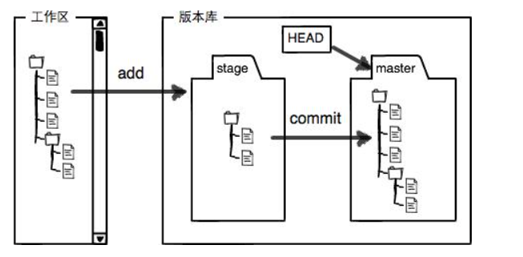
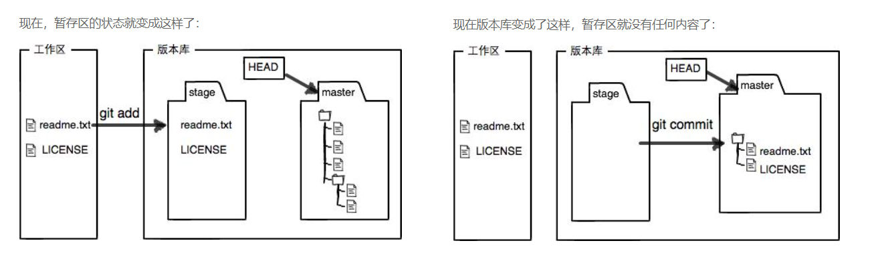

### 工作区（Working Directory）

- 电脑上能看到的一个目录

### 版本库

- 工作区有一个隐藏目录`.git`，是Git的版本库。

### 暂存区

- Git的版本库里存了很多东西，其中最重要的就是称为stage（或者叫index）的**暂存区**，还有Git为我们自动创建的第一个分支`master`，以及指向`master`的一个指针叫`HEAD`。

  

- 示例

  

- 

